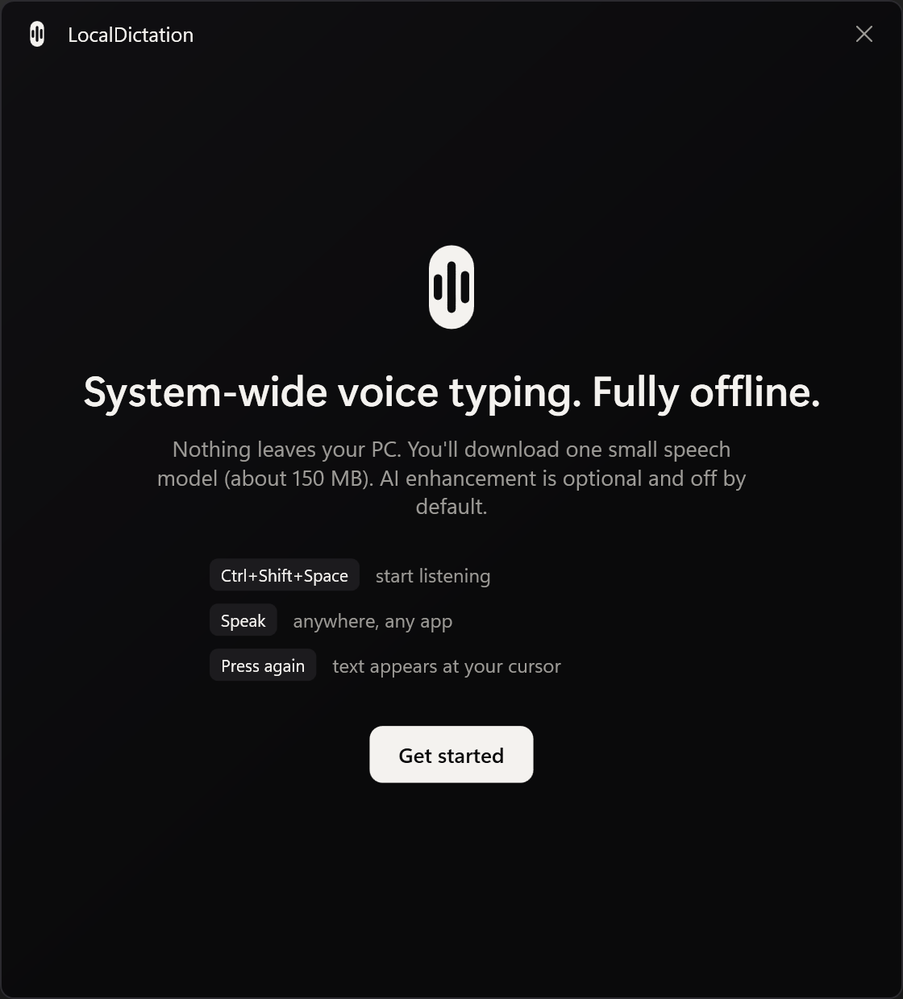
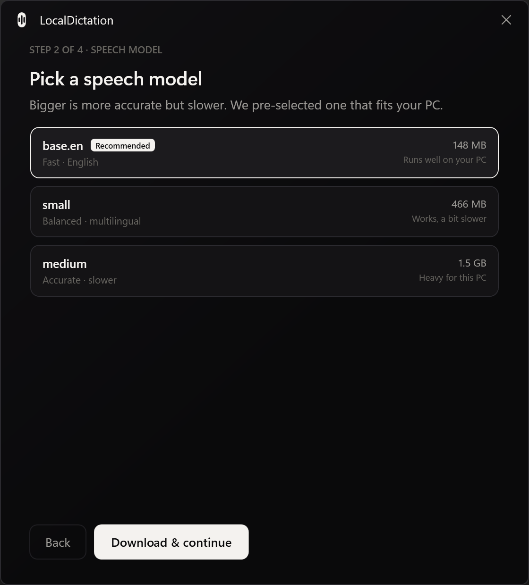
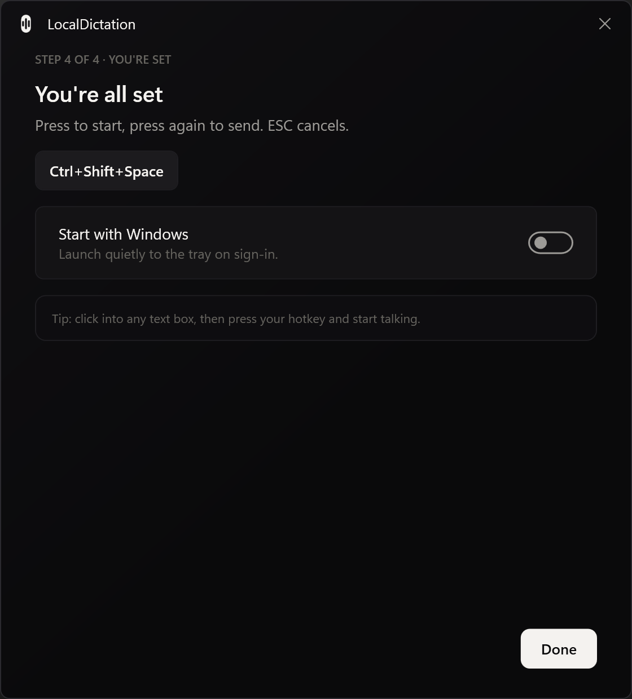
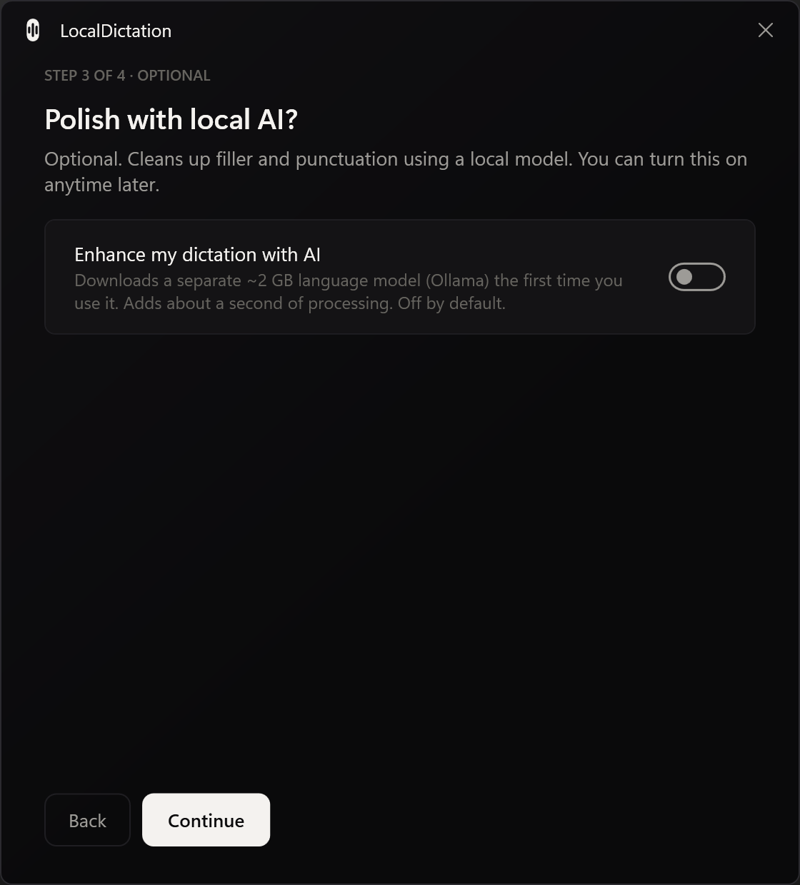
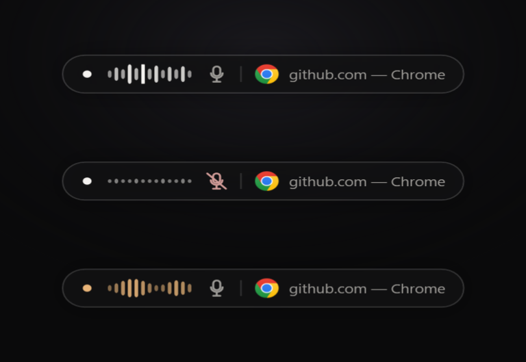
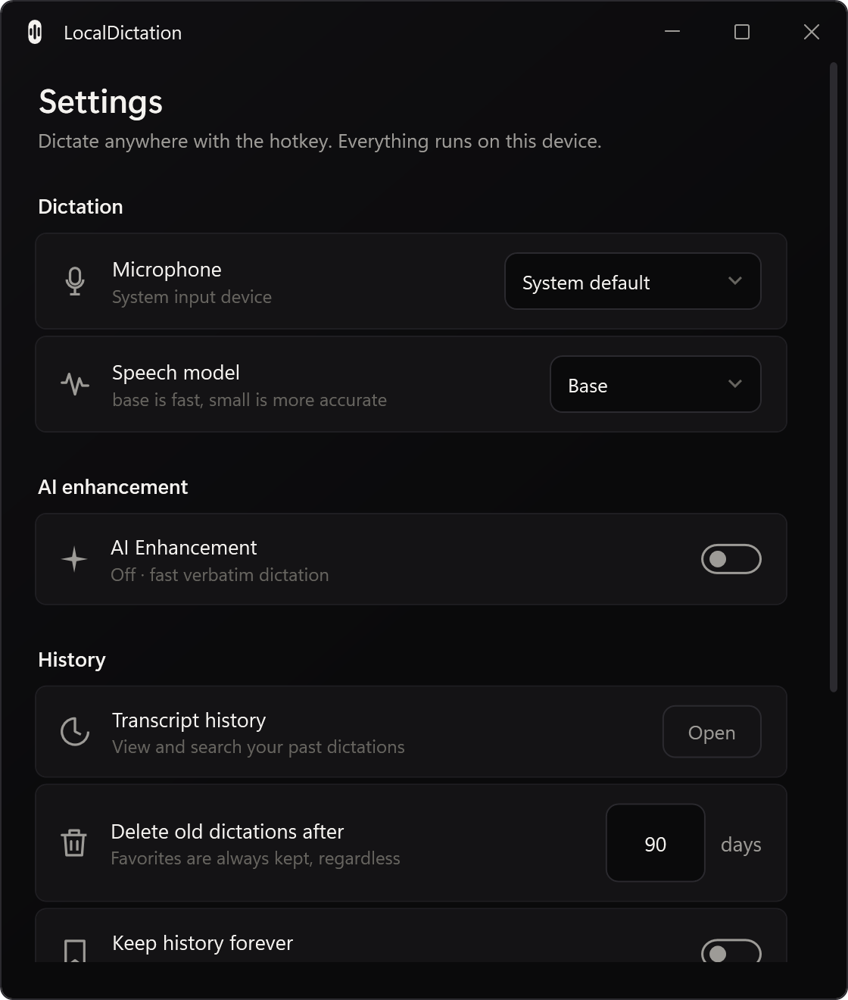
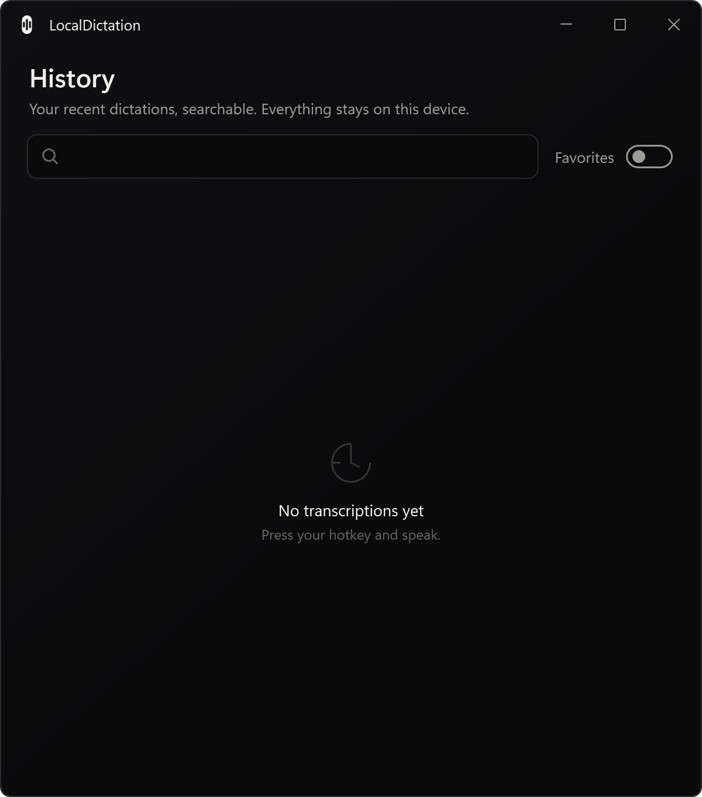

<div align="center">


# LocalDictation

**System-wide, offline, AI voice dictation for Windows and macOS.**


Press a global hotkey anywhere, speak, and your words are transcribed locally with Whisper — optionally polished by a local LLM — and inserted straight into whatever field has focus. Teams, Slack, Notion, VS Code, browsers, terminals, Word, anywhere.

**Runs natively on both the Windows and the Apple ecosystem** — one codebase, a native app on each.

**No cloud. No accounts. No audio ever leaves your device.**

</div>

---

## Install

### Windows 10/11

1. **[⬇ Download the latest installer](https://github.com/KunalKumarkkr01/LocalDictation/releases/latest/download/LocalDictation-win-Setup.exe)** (`LocalDictation-win-Setup.exe`, ~77 MB).
2. **Run it.** It installs per-user in seconds — no admin rights needed. Because the app isn't code-signed yet, Windows SmartScreen may warn: click **More info → Run anyway**.
3. **Follow the first-run setup** (below). It downloads one small speech model, then you're dictating.

> The installer is small on purpose. The speech model (~150 MB) is downloaded on first run, and the optional AI language model (~2 GB) only if you turn AI on — so you never download more than you use. The app **auto-updates** itself from GitHub Releases going forward.

### macOS (Apple silicon)

1. **[⬇ Download the latest disk image](https://github.com/KunalKumarkkr01/LocalDictation/releases/latest/download/LocalDictation-osx-Setup.dmg)** (`LocalDictation-osx-Setup.dmg`, arm64).
2. **Open the `.dmg` and drag LocalDictation into your Applications folder.**
3. **First launch — get past Gatekeeper.** The app isn't notarized yet, so a plain double-click is blocked. **Right-click (or Control-click) LocalDictation → Open**, then confirm **Open** in the dialog (or go to **System Settings → Privacy & Security** and click **Open Anyway**). You only do this once — the same spirit as Windows SmartScreen's "More info → Run anyway".
4. **Grant two permissions** the first time you dictate (macOS will prompt, and you can toggle them any time in **System Settings → Privacy & Security**):
   - **Microphone** — so LocalDictation can record you.
   - **Accessibility** — so it can detect the focused field and insert the transcribed text. Enable LocalDictation under **Privacy & Security → Accessibility**.
5. **Follow the first-run setup** (below) — it downloads one small speech model, then you're dictating.

> For AI enhancement on macOS, install **[Ollama for macOS](https://ollama.com/download)**. LocalDictation uses it automatically if it's installed and on your `PATH`; leave AI off and you never need it.

### First run

A five-step wizard gets you to working dictation. AI is a clearly optional detour.

| Welcome | Pick a speech model | You're set |
|---|---|---|
|  |  |  |

The setup checks your mic, recommends a Whisper model that fits your machine and downloads it with live progress, offers optional local-AI enhancement (**off by default**), and confirms your hotkey. Everything is on-device.

<div align="center"></div>

---

## Using it

| | |
|---|---|
| **Start / stop** | Press **`Ctrl+Shift+Space`** anywhere (same hotkey on Windows and macOS) to start listening; press it **again** to send. The text is typed into the focused control (and left on your clipboard so you can re-paste it). |
| **Persona picker** | Press **`Ctrl+Shift+P`** to open a searchable persona palette and apply a chosen persona to a single dictation — handy for browser webmail and terminal-hosted coding agents that auto-detection can't identify. The palette only opens once AI enhancement is on and the model is loaded; if AI is off or still getting ready, it tells you and points you to Settings (so a pick never lands in a silent wait). |
| **Cancel** | `Esc` while listening. |
| **Listening capsule** | A small glass pill appears bottom-center with a live, frequency-reactive waveform, a **mic-status icon** (turns red with a slash if your mic is muted), and the **real icon + name of the app you're dictating into**. It glows gold while transcribing. |
| **Settings & history** | **Windows:** right-click the tray icon (the waveform capsule). **macOS:** click the menu-bar item at the top-right. Both open the same menu — Dictate now / History / Control panel / Quit — and the control panel and history window apply changes immediately. |
| **AI enhancement** | Off by default for fast, verbatim output. Turn it on in the control panel to add grammar-fix / rewrite / translate / summarize via a local LLM. |

<div align="center">
  
  <p><em>The listening capsule, bottom-center — a live frequency-reactive waveform, a mic-status icon, and the focused app's real icon + name. Top to bottom: <strong>listening</strong> (white), <strong>mic muted</strong> (red mic-slash), and <strong>transcribing</strong> (soft gold).</em></p>
</div>

### The app

| Control panel | History |
|---|---|
|  |  |

The tray icon (menu-bar item on macOS), control panel, history window and on-screen capsule share one monochrome identity — the "settings card" pattern, immediate-apply, with a single soft-gold accent reserved for the transient processing state. On Windows it follows the Windows 11 Fluent look; on macOS it uses native window chrome (traffic-light buttons) over the same theme.

---

### Personas

Personas are named AI system prompts that adapt the enhancement output to where you're dictating — a Notion doc gets structured Markdown, an email gets a greeting and a closing, a Teams message stays short and conversational. They're **AI-enhancement prompts, not a gate on AI**: a persona only applies when AI is on; "AI on, no persona matched" still runs the generic cleanup prompt, never raw text.

- **Auto-detect** — with AI on, dictating into Notion, Outlook, or Teams automatically applies that app's persona, matched by the focused window's process name. No match falls back to your configured default persona.
- **Picker (`Ctrl+Shift+P`)** — opens a searchable palette of every persona, including a **Coding Agent** persona for turning loose speech into a precise implementation prompt. This is the way to reach browser webmail and terminal-hosted coding agents that process-name detection can't identify. The palette is gated on AI readiness: it only opens once AI enhancement is on and the model is loaded, and otherwise tells you the state (off / getting ready) and points you to Settings — so a persona pick never stalls on a model that isn't ready.
- **Every prompt is editable** in the control panel, including the built-in app personas and the default/legacy cleanup prompts (now editable "System" personas) — each has a one-click **Reset to default**. Custom personas you create are freely deletable.
- **Storage & sharing** — personas live in `personas.json`, next to `settings.json` in the app-data folder. **Export** writes that file as-is; **Import merges**: it adds new personas and updates your own custom ones, and it never touches the built-in System/BuiltIn personas — re-importing a shared or stale file is always safe.

---

## Features

| | |
|---|---|
| 🎹 **Global hotkey** | Toggle activation from any foreground app. Press to start, press to send — never chops speech mid-sentence. |
| 🗣️ **Local Whisper** | Whisper.net (whisper.cpp) with hardware-aware model selection (`base.en` / `small` / `medium`). **0% WER** on the eval corpus. |
| 🧠 **Optional local LLM** | Opt-in Ollama post-processing: grammar fix, professional rewrite, translate, summarize, Markdown, custom prompts. Ollama is auto-installed on first enable. |
| 🎭 **Context-aware personas** | Auto-picks the AI prompt from the focused app (Notion, Email, Teams, …) when AI is on, or apply one for a single dictation via the picker hotkey (`Ctrl+Shift+P`) — see [Personas](#personas) below. |
| 🎯 **Smart insertion** | Prioritised strategy chain (clipboard → SendInput → UIA) with clipboard save/restore. If you click away before finishing, the text opens in a **glass editor** instead of landing in the wrong app. |
| 🩺 **Diagnostics** | Pre-flight checks tell you the *real* reason a dictation failed (missing model, unloadable engine, no mic) with fix steps. **Settings › System status** shows live health, a **Reload model** button, and a mic-free **Test dictation** self-test. |
| 🔒 **Privacy guards** | Password/sensitive-field detection (UIA `IsPassword`), per-app blocklist, "never touch clipboard" mode. |
| 🕘 **History** | SQLite + FTS5 full-text search, favourites, retention pruning. Last dictation always re-pastable. |
| 🎨 **Monochrome UI** | A restrained black-and-white design — Windows 11 Fluent on Windows, native chrome on macOS; a single soft-gold accent marks the transient "processing" state. |

---

## How it's made

📖 **[Full developer documentation →](https://kunalkumarkkr01.github.io/LocalDictation/)** — architecture, the end-to-end flow, subsystems, and distribution, in depth.

- **Stack:** .NET 8, C#, **Clean Architecture + MVVM** (dependencies point inward only, enforced by NetArchTest). The UI shell is **WPF on Windows** and **[Avalonia UI](https://avaloniaui.net) on macOS**, both over the same shared `Domain` / `Application` / `Infrastructure` core.
- **Speech:** [Whisper.net](https://github.com/sandrohanea/whisper.net) (whisper.cpp / GGML), 16 kHz mono capture (NAudio on Windows, AVFoundation/CoreAudio on macOS).
- **AI:** local [Ollama](https://ollama.com) (Phi-3.5-mini by default), managed entirely behind the AI toggle.
- **Packaging & updates:** **Windows** ships via [Velopack](https://velopack.io) — a small per-user installer with automatic delta updates from GitHub Releases. **macOS** ships as an unsigned `.app` bundle packaged into `LocalDictation-osx-Setup.dmg` (`create-dmg`), built on a GitHub Actions `macos-latest` runner.
- **Design:** monochrome Fluent language; the app mark is a vertical capsule with a waveform cut through it in negative space — the same shape as the on-screen listening pill.

```
src/
  LocalDictation.Domain            Entities, enums (no dependencies)
  LocalDictation.Application       Use cases + port interfaces (DictationPipeline, ISpeechEngine…)
  LocalDictation.Infrastructure    Adapters: Whisper, Ollama, NAudio, Win32/UIA, SQLite, Velopack paths
  LocalDictation.Desktop           UI shell (WPF on Windows, Avalonia on macOS): composition root, capsule overlay, tray/menu-bar, onboarding, settings, history
  LocalDictation.Shared            Result<T>, guards
  LocalDictation.Evals             Whisper WER/latency + LLM evaluation harness
tests/                             xUnit unit tests + NetArchTest architecture rules (43 tests)
```

The **why** behind every significant decision lives in [`docs/adr/`](docs/adr) (Architecture Decision Records). Distribution specifics are in [`docs/distribution-plan.md`](docs/distribution-plan.md); the full original design is [`implementation-plan.html`](implementation-plan.html).

---

## Build from source

Requires the [.NET 8 SDK](https://dotnet.microsoft.com/download/dotnet/8.0) (the repo pins SDK `8.0.417` via `global.json`).

```powershell
git clone https://github.com/KunalKumarkkr01/LocalDictation.git
cd LocalDictation

# Download Whisper models (base.en + small) into models/whisper/
./scripts/setup-models.ps1

# Run the tray app
dotnet run --project src/LocalDictation.Desktop

# Tests (17) and the WER/latency eval harness
dotnet test  LocalDictation.sln
dotnet run --project src/LocalDictation.Evals
```

### Package your own installer

```powershell
dotnet tool install -g vpk
dotnet publish src/LocalDictation.Desktop/LocalDictation.Desktop.csproj -c Release -r win-x64 --self-contained true -o .\artifacts\publish
vpk pack --packId LocalDictation --packVersion 1.0.0 --packDir .\artifacts\publish --mainExe LocalDictation.exe --icon .\src\LocalDictation.Desktop\Assets\tray.ico --outputDir .\artifacts\Releases
```

> Publish **multi-file** (not `PublishSingleFile`) — whisper.net loads its native library from disk next to the exe; single-file self-extraction hides it. Velopack packages the folder into one `Setup.exe` either way.

---

## Evaluation

The harness synthesizes known sentences via Windows TTS, runs them through the real Whisper engine, and measures accuracy + latency, then exercises the LLM path. Latest run (Ryzen, CPU-only):

| Model | WER | Avg latency | Real-time factor |
|---|---|---|---|
| Whisper `base` | **0.0%** | ~2.5 s | **1.7–1.9×** |
| Whisper `small` | **0.0%** | ~8 s | 0.5–0.6× |

Local LLM (Phi-3.5-mini) grammar/rewrite/format: ~0.5–0.8 s warm. Full JSON report at `artifacts/eval-report.json`.

---

## Uninstall

**Settings → Apps → Installed apps → LocalDictation → Uninstall**, or run `%LocalAppData%\LocalDictation\Update.exe --uninstall`. To wipe your on-device data too (settings, history, downloaded models), delete the `%LocalAppData%\LocalDictation` folder afterward.

---

## License

MIT
